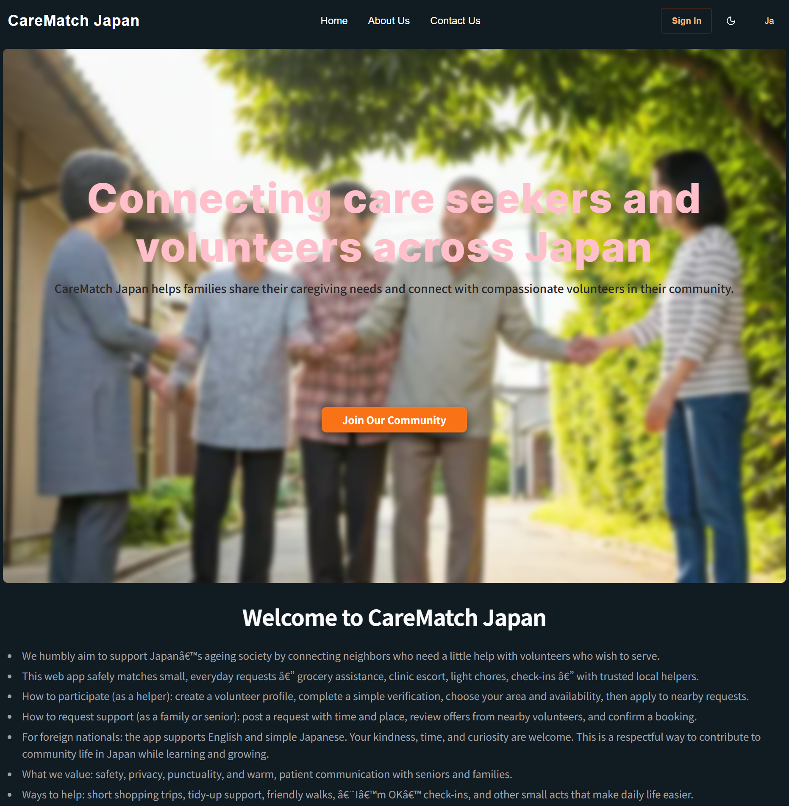

# CareMatch Japan

> **Status:** Ongoing Project  
> Connecting caregiving families with compassionate volunteers in Japan. CareMatch JP safely matches everyday support requests like grocery help, clinic escort, light chores, friendly check-in with trusted local helpers. The app is bilingual (Japanese / English) and welcomes foreign nationals to participate and contribute to community life in Japan.

  

---

## Tech Stack

- **Framework:** Next.js (App Router) + React
- **Language:** TypeScript
- **Styling/UI:** Chakra UI (with dark/light mode)
- **i18n:** `next-intl` (ja/en, locale-aware routing & messages)
- **Auth:** Auth.js (NextAuth) with **LINE Login** (OpenID Connect)
- **Database:** MongoDB + Mongoose
- **Server:** Node.js, with optional Express-style middleware/handlers where needed
- **State/Forms:** React (client components) + server route handlers 
- **Deployment:** (TBD: Vercel )

---

## Features (Current Scope)

-  **Sign in / Sign up with LINE** (Auth.js provider)
-  **Compulsory profile completion** after first login
- **Care Seeker** form (60+): first/last name, age validation, address, contact number, support categories
- **Care Giver / Volunteer** form: service radius, skills, availability, intro (coming next)
-­ **Role-aware Dashboard**
- Single entry `/[locale]/dashboard` → redirects:
- Missing profile → `/[locale]/onboarding/profile`
- Seeker profile → `/[locale]/dashboard/seeker`
- Giver profile → `/[locale]/dashboard/giver`
- **Bilingual UX** (日本語 / English) with locale-prefixed routes and translated copy
- **Clean data model** (single user, multiple roles: seeker/giver)
- **Accessible inputs** (IME-friendly for Japanese typing; `lang="ja"` hints)

---

